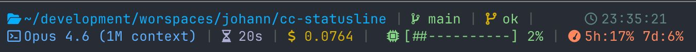

# cc-statusline

CLI that generates a self-contained bash script for [Claude Code](https://docs.anthropic.com/en/docs/claude-code)'s statusline. Inspired by [Powerlevel10k](https://github.com/romkatv/powerlevel10k)'s visual style.




## Prerequisites

- [Bun](https://bun.sh) runtime
- [jq](https://jqlang.github.io/jq/) for JSON parsing in the generated script
- [Nerd Font](https://www.nerdfonts.com/) for icons

## Quick Start

```bash
# Install dependencies
bun install

# 1. Scaffold config (optional -- defaults are sensible)
bun run src/cli.ts init

# 2. Generate the statusline script + auto-update ~/.claude/settings.json
bun run src/cli.ts generate

# 3. Preview with mock data
bun run src/cli.ts preview
```

That's it. Claude Code will use the generated script on the next assistant message.

## Commands

### `init`

Creates `~/.config/cc-statusline/config.yaml` with the default layout.

```bash
bun run src/cli.ts init          # create config
bun run src/cli.ts init --force  # overwrite existing
```

### `generate`

Generates `~/.config/cc-statusline/statusline.sh` and updates `~/.claude/settings.json` to point to it.

```bash
bun run src/cli.ts generate
bun run src/cli.ts generate --config ./custom.yaml     # custom config path
bun run src/cli.ts generate --output ./statusline.sh    # custom output path
bun run src/cli.ts generate --skip-settings             # don't touch settings.json
```

### `preview`

Runs the generated script with mock data so you can see what it looks like.

```bash
bun run src/cli.ts preview
```

## Configuration

Edit `~/.config/cc-statusline/config.yaml`. Re-run `generate` after changes.

### Default Layout

```yaml
theme: default
line1:
  left: [os_icon, directory, git_branch, git_status]
  right: [model, agent_name, vim_mode]
line2:
  left: [cost, duration, lines_changed]
  right: [context_bar, rate_limits, time]
segments: {}
```

### Available Segments

**Claude Code** (extracted from CC JSON via jq):

| Segment | Description |
|---------|-------------|
| `model` | Model display name |
| `cost` | Total session cost (USD) |
| `context_bar` | Context window usage bar + percentage |
| `rate_limits` | 5h/7d rate limit usage |
| `duration` | Session duration (Xh Ym Zs) |
| `lines_changed` | Lines added/removed |
| `session_id` | Session ID (first 8 chars) |
| `vim_mode` | Vim mode (normal/insert/visual) |
| `worktree` | Worktree info |
| `agent_name` | Active agent name |

**System** (shell commands):

| Segment | Description |
|---------|-------------|
| `os_icon` | OS icon (nerd font) |
| `user_host` | user@hostname |
| `time` | Current time (HH:MM:SS) |
| `directory` | Current directory from CC JSON |

**Git** (shell commands):

| Segment | Description |
|---------|-------------|
| `git_branch` | Current branch name |
| `git_status` | Staged/modified/untracked counts |

### Per-Segment Overrides

Override colors or icons for any segment:

```yaml
segments:
  model:
    enabled: true
    fg: "75"       # ANSI 256 color
    icon: ""      # custom nerd font icon
  cost:
    enabled: false  # hide this segment
```

## How It Works

`cc-statusline` is a **code generator**, not a runtime. The CLI produces a bash script that:

1. Reads JSON from stdin (piped by Claude Code)
2. Extracts fields with `jq`
3. Runs shell commands for git/system segments
4. Formats output with ANSI colors
5. Echoes exactly 2 lines

The generated script is self-contained and fast (<100ms).

## Development

```bash
bun test        # run tests
bun lint        # biome check
bun knip        # dead code detection
bun typecheck   # tsc --noEmit
```

## License

MIT
